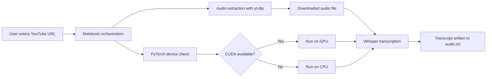

# AI Speech Recognition Tool

An experimental speech-to-text workflow that downloads audio from a YouTube URL and transcribes it with OpenAI Whisper. The current implementation is notebook-based and saves the final transcript to `audio.txt`.

## Overview

This project demonstrates a simple end-to-end audio transcription pipeline:

1. Check CUDA availability with PyTorch.
2. Download the best available audio stream from a YouTube link using `yt-dlp`.
3. Transcribe the downloaded audio with Whisper (`large-v3`).
4. Write the transcript to `audio.txt`.

## Architecture

The project is organized as a lightweight, notebook-driven pipeline with four main stages:



### Components

- Notebook orchestration: `__notebook_source__.ipynb` controls execution order, input collection, extraction, transcription, and output writing.
- Device detection: PyTorch is used to detect whether CUDA is available before loading the Whisper model.
- Audio extraction: `yt-dlp` downloads the best available audio stream and includes a fallback extractor path if the standard method fails.
- Transcription engine: Whisper `large-v3` performs speech recognition on the downloaded audio.
- Output artifact: the final transcript is persisted to `audio.txt` for review or downstream use.

### Data Flow

1. The user provides a YouTube URL.
2. The notebook attempts to extract the audio stream.
3. The extracted media is stored locally as an intermediate audio file.
4. Whisper processes the media on GPU or CPU depending on the runtime environment.
5. The resulting text is saved to `audio.txt`.

### Design Notes

- The architecture is intentionally simple so it can be inspected and modified by developers quickly.
- The transcription model is large and resource-intensive, which favors accuracy over lightweight deployment.
- The pipeline is sequential rather than service-based, so failures are easy to isolate at each stage.

## Key Technologies

- Python
- PyTorch
- Whisper
- `yt-dlp`

## Prerequisites

- Python 3.10+ recommended
- A working internet connection for downloading audio
- Optional: NVIDIA GPU with CUDA support for faster transcription

## Installation

Create a virtual environment if needed, then install the dependencies:

```bash
pip install -r requirements.txt
```

If Whisper model downloads are required on first run, allow the process to complete before starting transcription.

## Usage

Open `__notebook_source__.ipynb` and run the cells in order.

When prompted, enter a valid YouTube URL. The notebook will:

- attempt a standard audio extraction,
- fall back to an Android-style extractor configuration if needed,
- transcribe the downloaded file using Whisper,
- save the transcript as `audio.txt`.

## Output

- `audio.txt`: final transcription output
- `audio.mp4` or another downloaded audio file: intermediate media artifact generated by `yt-dlp`

## Notes for Developers

- The notebook currently uses `whisper.load_model("large-v3")`, which is accurate but resource-intensive.
- Transcription is set to run on GPU when CUDA is available, otherwise it falls back to CPU.
- The current notebook assumes the downloaded file name matches the transcription input path. If you change the downloader output template, update the transcription path accordingly.

## Project Structure

```text
.
|-- __notebook_source__.ipynb
|-- audio.txt
|-- requirements.txt
`-- README.md
```

## Maintainer

Prepared for internal developer review by a third-year intern at Annam.ai, IIT Ropar.
=======
# ai-speech-recognition-tool
>>>>>>> faf27f5d5a044c8e063093941adb2dda5363f565
